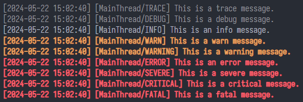
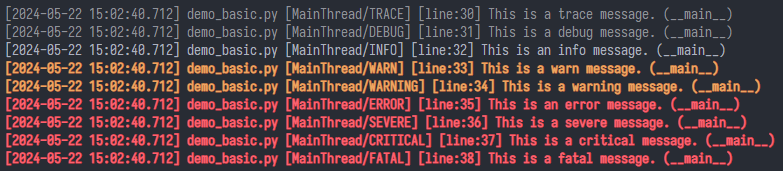
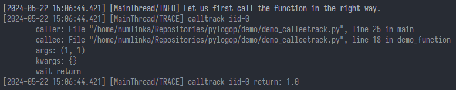
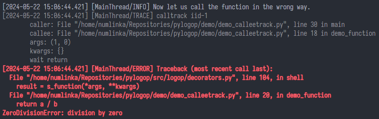

<div align="center">

<a style="text-decoration:none" href="https://github.com/numlinka/pylogop">
  
</a>

# pylogop

_This is a lightweight and scalable Python logging library._

<a style="text-decoration:none" href="https://opensource.org/license/mit">
  
</a>
<a style="text-decoration:none" href="https://pypi.org/project/logop">
  
</a>
<a style="text-decoration:none" href="https://www.python.org">
  
</a>

<p></p>

English | [简体中文](README_zh.md)


<div align="left" style="max-width: 1000px;">

## Introduce

This is a lightweight and scalable Python logging library.
It is a library independent from [simplepylibs](https://github.com/numlinka/simplepylibs).


## Install

The preferred way to install logop is via pip.

```bash
pip install logop
```

To upgrade logop to the latest version, use the following command:

```shell
pip install --upgrade logop
```


## Usage

### Basic usage

Here is a simple usage example:

```Python
import logop

logger = logop.Logging()
logger.info("Hello, world!")
logger.debug("This is a debug message.")  # This message will not be printed.
```

You can adjust the logger's log level and format.

```Python
logger.set_level(logop.DEBUG)
logger.set_format(logop.FORMAT_DEBUG)
```

Or set them on instantiation.

```Python
logger = logop.Logging(level=logop.DEBUG, format=logop.FORMAT_DEBUG)
```

You can also write your own log format.

```Python
logger.set_format("[$(.levelname)] $(.message)")
```


If you want to output a log with color,
then you need to refuse it to automaticallycreate a standard output object when creating logging. 

Then add a better output object to it.

```Python
logger = Logging(stdout=False)
logger.add_op(logop.LogopStandardPlus())
```

Or you want to output the log to the file.

```Python
fileobj = logop.LogopFile(directory="logs", filename="$(.date).log")
logger.add_op(fileobj)
```


### Advanced usage

You can use custom levels and names to output logs<

```Python
logger.call(logop.DEBUG, "FINE", "This is a fine message.")
```

You can also add custom log levels to `LEVEL_TABLE` in the following format.

```Python
# ? LEVEL_TABLE[alias] = (level, level_name)
logop.LEVEL_TABLE["fine"] = (logop.DEBUG, "FINE")
```

Then you can use the alias as the attribute name to output the log directly in the logger.

```Python
logger.fine("This is a fine message.")
```

Add the `callabletrack` decorator to a function to track who calls the function,
the parameters provided and its return value.

```Python
@logop.callabletrack
def test_func(a, b, c):
    ...
```

Set `exception` of `callabletrack` to `True` to log exception information.

```Python
@logop.callabletrack(exception=True)
def test_func(a, b, c):
    ...
```


## Demo

Output some simple log messages.



Or output more detailed content.




Trace function calls and returns.



Trace function exceptions.




I've provided some simple demo files. You can run them by executing the following command.

```shell
python ./demo/demo_basic.py
python ./demo/demo_calleetrack.py
```


## Documentation

Nothing


## License

This project is licensed under the MIT License.

</div>
</div>
